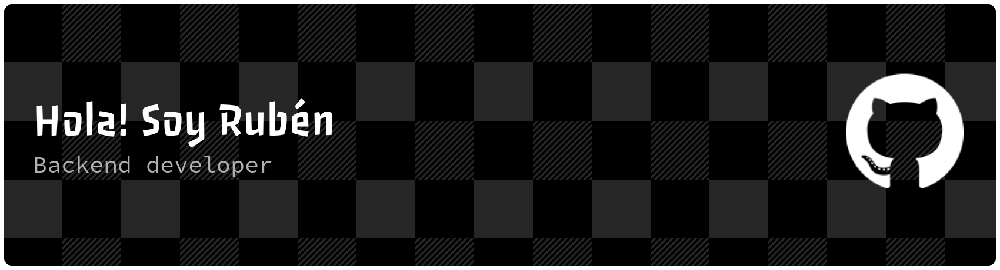

Desarrollador Backend con experiencia en aplicaciones web y APIs REST utilizando **Java, Spring Boot, Python y Flask**. Formación en arquitecturas limpias (Hexagonal, Clean Architecture), testing automatizado y CI/CD.

Antes de dedicarme al desarrollo, dediqué **19 años a la automatización industrial** gestionando proyectos de alta complejidad en Bosch Rexroth y Vigotec. Esa trayectoria me aporta una sólida capacidad analítica, enfoque en resolución de problemas y experiencia en entornos de alta disponibilidad.

---

🛠️ Tecnologías y herramientas

**Core backend**

**Stack y testing**

**Otros conocimientos**

**Herramientas**

---

## Proyectos destacados

**Market Analysis App** — Motor de análisis técnico de acciones
> App web de análisis técnico de activos financieros con Arquitectura Hexagonal. Integra datos de mercado de APIs externas, motor de estrategias declarativas y componentes de IA generativa. Java 21, Spring Boot 3, MySQL, Thymeleaf, JUnit 5, JaCoCo >80%.
> [Repo](https://github.com/RubenToucedaPRO/market-analysis-app)

**Gestión Escolar** — Sistema web de administración educativa
> Sistema completo para gestión integral de un centro educativo. Autenticación con sesiones HTTP y roles, arquitectura en capas con Blueprints Flask modulares. Python 3, Flask, Jinja 2, unittest + coverage.
> [Repo](https://github.com/RubenToucedaPRO/gestion-escolar-python)

**Mi Despensa** — Gestión inteligente de inventario doméstico
> App web con escaneo de códigos de barras, Spring Security, integración con Cloudinary (imágenes) y APIs externas. Java 17, Spring Boot 3, MySQL, Thymeleaf.
> [Repo](https://github.com/RubenToucedaPRO/springboot-mi-despensa-webapp)

---

## Formación

- **Master de Desarrollo con IA** — Big School *(en curso)*
- **Curso de Especialización en Python** (430h) — IES Muralla Romana
- **Ciclo Superior DAM** — IES Muralla Romana

---

📫 Cómo contactarme:
- [LinkedIn](https://www.linkedin.com/in/ruben-touceda-martinez)
- [Email](mailto:ruben.touceda@gmail.com)

---
## GitHub stats

<a href="https://github-stats-extended.vercel.app/api?username=RubenToucedaPRO">
  <picture>
    <source
      srcset="https://github-stats-extended.vercel.app/api?username=RubenToucedaPRO&theme=dark_github"
      media="(prefers-color-scheme: dark)"
    />
    
  </picture>
</a>
<a href="https://github-stats-extended.vercel.app/api/top-langs?username=RubenToucedaPRO&layout=compact&langs_count=8&card_width=320">
  <picture>
    <source
      srcset="https://github-stats-extended.vercel.app/api/top-langs?username=RubenToucedaPRO&layout=compact&langs_count=8&card_width=320&theme=dark_github"
      media="(prefers-color-scheme: dark)"
    />
    
  </picture>
</a>
