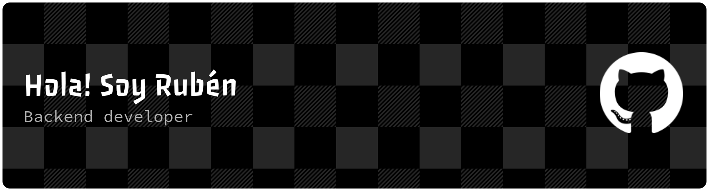

Desarrollador Full-Stack junior con verdadera pasión por la programación. Me considero una persona seria, responsable y comprometida. Prueba de ello son los 19 años que trabajé para la misma empresa, lo que respalda mi profesionalidad y constancia.

Tengo amplios conocimientos en **Java y Spring Boot**. Durante mis cuatro meses de prácticas en empresa participé activamente en un proyecto real con esta tecnología, y también la utilicé para desarrollar mi proyecto de fin de curso.

---

🔭 Actualmente estoy trabajando en:
- Una aplicación web full-stack para la **gestión de despensa, lista de la compra y recetas** , como evolución de mi proyecto de fin de curso.

👉 [Ver sección "Mi despensa (versión pública)"](https://github.com/RubenToucedaPRO/springboot-mi-despensa-webapp-public?tab=readme-ov-file#mi-despensa-versi%C3%B3n-p%C3%BAblica)

🌱 Estoy aprendiendo:

---

🛠️ Tecnologías y herramientas que conozco

**Lenguajes y tecnologías**

**Herramientas y entornos de desarrollo**  

---

📫 Cómo contactarme:
- [LinkedIn](https://www.linkedin.com/in/rubén-touceda-martinez)
- [Email](mailto:ruben.touceda@gmail.com)

---
## GitHub stats

 
 

---

